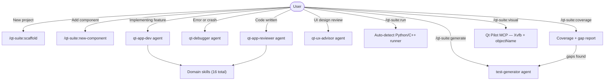

# qt-suite

Complete Qt development and testing toolkit: proactive specialist agents, 16 domain skills, scaffolding commands, and headless GUI testing via the bundled Qt Pilot MCP server. Covers PySide6, PyQt6, and C++/Qt.

## Summary

Qt GUI development involves many interacting systems (signals and slots, layout managers, Model/View architecture, threading constraints, and platform packaging), each with non-obvious pitfalls. On the testing side, Qt applications present unique challenges: C++ templates make unit test scaffolding awkward, coverage tools differ between Python and C++ builds, and GUI components require a live display server or headless substitute.

`qt-suite` handles both sides. Domain skills load at the right moment; specialist agents activate proactively during development and after code changes. Six commands cover project scaffolding, component generation, test generation, test execution, coverage analysis, and headless visual verification.

## Principles

**[P1] Right knowledge at the right moment**: Skills load contextually; agents trigger proactively. Domain knowledge appears when needed without requiring explicit invocation.

**[P2] Testability is a first-class concern**: Every generated component includes `setObjectName()` calls and MVP-compatible structure so the `gui-tester` can find and interact with all widgets without modification.

**[P3] Complete implementations over pseudocode**: All generated code is runnable as-is. Stubs are clearly marked with `# TODO`. No placeholder logic for required structural elements.

**[P4] Binding-agnostic where possible**: Skills and agents work with PySide6, PyQt6, and C++/Qt. Binding-specific differences are documented, not hidden.

**[P5] Coverage-driven test generation**: Tests are generated from identified coverage gaps, not arbitrary files. The coverage report is the source of truth for what needs testing next.

**[P6] Headless-first GUI testing**: Visual tests launch via Xvfb with no display server configuration required. Qt Pilot identifies widgets by `objectName`, falling back to coordinate-based clicks only when names are absent.

## Requirements

| Requirement | Purpose | Install |
|-------------|---------|---------|
| Python 3.11+ | Qt development + Qt Pilot MCP | System package |
| PySide6 6.6+ or PyQt6 6.6+ | Qt bindings | `pip install PySide6` |
| Xvfb | Virtual display for headless GUI testing | `apt install xvfb` / `dnf install xorg-x11-server-Xvfb` |
| lcov | C++ coverage HTML reports | `apt install lcov` (optional) |
| cmake | C++ build/test | `apt install cmake` (optional) |

> Qt Pilot's Python dependencies (PySide6, mcp) are automatically installed into a virtual environment inside the plugin on first use.

Run `bash <plugin-root>/scripts/check-prerequisites.sh` to verify your setup.

## Installation

```bash
/plugin marketplace add L3DigitalNet/Claude-Code-Plugins
/plugin install qt-suite@l3digitalnet-plugins
```

For local development:

```bash
claude --plugin-dir ./plugins/qt-suite
```

## How It Works



## Usage

Run `/qt-suite:scaffold <app-name>` to initialize a new project with the standard layout and test config. Use the commands below as development progresses. The four specialist agents (`qt-app-dev`, `qt-debugger`, `qt-app-reviewer`, `qt-ux-advisor`) activate proactively with no explicit invocation needed.

## Commands

| Command | Description |
|---------|-------------|
| `/qt-suite:scaffold [app-name]` | Scaffold a new PySide6 project with pyproject.toml, src layout, QMainWindow boilerplate, and `.qt-test.json` |
| `/qt-suite:new-component <name> [widget\|dialog\|window]` | Generate a Qt component class with correct boilerplate and object names |
| `/qt-suite:generate` | Scan the project and generate unit tests for untested files |
| `/qt-suite:run` | Auto-detect project type and run the full test suite |
| `/qt-suite:coverage` | Run coverage analysis, generate HTML report, identify gaps |
| `/qt-suite:visual` | Launch app headlessly and run visual GUI tests via Qt Pilot |

## Skills

| Skill | Binding | Loaded when |
|-------|---------|-------------|
| `qt-architecture` | Both | Structuring a Qt app, QApplication setup, project layout |
| `qt-signals-slots` | Both | Connecting signals, defining custom signals, cross-thread communication |
| `qt-layouts` | Both | Arranging widgets, resize behavior, QSplitter, layout debugging |
| `qt-model-view` | Both | QAbstractTableModel, QTableView, QSortFilterProxyModel, delegates |
| `qt-threading` | Both | QThread, QRunnable, thread safety, keeping UI responsive |
| `qt-styling` | Both | QSS stylesheets, theming, dark/light mode, QPalette |
| `qt-resources` | Both | .qrc files, pyrcc6, embedding icons and assets |
| `qt-dialogs` | Both | QDialog, QMessageBox, QFileDialog, custom dialogs |
| `qt-packaging` | Python | PyInstaller, Briefcase, platform deployment, CI builds |
| `qt-debugging` | Both | Qt crashes, widget visibility, event loop, threading issues |
| `qt-qml` | Both | QML/Qt Quick, QQmlApplicationEngine, exposing Python to QML |
| `qt-settings` | Both | QSettings, persistent preferences, window geometry, recent files |
| `qt-bindings` | Python | PySide6 vs PyQt6 differences, PyQt5 migration guide |
| `qtest-patterns` | Both | Writing QTest (C++), pytest-qt (Python), or QML TestCase tests |
| `qt-coverage-workflow` | Both | Working with coverage gaps, gcov, lcov, or coverage.py |
| `qt-pilot-usage` | Python | Headless GUI testing, widget interaction, Qt Pilot MCP usage |

## Agents

| Agent | Description |
|-------|-------------|
| `qt-app-dev` | Proactive Qt development specialist. Triggers when creating new Qt projects, implementing widgets/windows, or building new features. |
| `qt-debugger` | Proactive diagnostics for Qt errors and crashes. Triggers on error messages, crashes, frozen UIs, or unexpected widget behavior. |
| `qt-app-reviewer` | Proactive code quality reviewer. Triggers after writing or modifying Qt code. Checks for GC risks, threading violations, missing object names, layout anti-patterns. |
| `qt-ux-advisor` | Proactive UI/UX reviewer. Triggers on UI design review, keyboard navigation requests, or accessibility checks. Enforces widget naming for testability. |
| `test-generator` | Coverage-gap-driven test generation. Scans source for untested paths, writes test files targeting identified gaps, and verifies new tests pass before completing. |
| `gui-tester` | Autonomous visual testing via Qt Pilot. Launches the app headlessly via Xvfb, interacts with widgets by `objectName`, captures screenshots, and writes a structured markdown test report. |

## Configuration

Create `.qt-test.json` in your project root (copy from `templates/qt-test.json`):

```json
{
  "project_type": "python",
  "build_dir": "build",
  "test_dir": "tests",
  "app_entry": "main.py",
  "coverage_threshold": 80,
  "coverage_exclude": ["tests/*"]
}
```

For personal overrides, create `.claude/qt-test.local.md` (Claude Code loads `.local.md` files from `.claude/` as additional context; add this path to your `.gitignore`):

```markdown
# Qt Suite local overrides
My app entry is src/app.py (not main.py).
Coverage threshold for this machine: 70%.
```

## CI Integration

Copy `skills/qt-coverage-workflow/templates/qt-coverage.yml` to `.github/workflows/` for automated coverage on every push.

Or use the portable shell script:

```bash
bash skills/qt-coverage-workflow/templates/run-coverage.sh --python --threshold 80
```

## Planned Features

No planned features at this time.

## Known Issues

- `/qt-suite:scaffold` and `/qt-suite:new-component` generate Python/PySide6 code only; no C++ template support yet.
- C++/Qt skill coverage is partial; primary focus is Python bindings.
- `qt-packaging` covers PyInstaller and Briefcase; Nuitka not yet covered.
- C++/Qt coverage requires a CMake-configured build directory; set `build_dir` in `.qt-test.json` manually for custom build systems.
- `pyside6-rcc` is not invoked automatically; pre-compile `.qrc` resources before running tests.
- Xvfb required for visual tests: macOS, Windows, and minimal CI containers cannot run `/qt-suite:visual`.

## Links

- [Changelog](CHANGELOG.md)
- [PySide6 documentation](https://doc.qt.io/qtforpython-6/)
- [Qt documentation](https://doc.qt.io/)
- [Qt Pilot MCP server](https://github.com/neatobandit0/qt-pilot) (MIT License)
